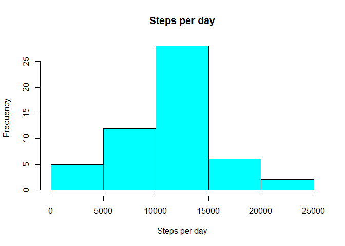

# Reproducible Research: Peer Assessment 1

## Loading and preprocessing the data
Data has been delivered as a standard CSV file, hence loading in R is 
straightforward

```r
activity <- read.csv("activity.csv", stringsAsFactors = FALSE)
```
We will be using the libraries:
* dplyr
* ggplot2
* mice


## What is mean total number of steps taken per day?
We will first prepare the data required.


```r
steps_per_day <- activity %>% group_by(date) %>% summarise(steps = sum(steps))
```

We can observe in the following plot the distribution of the steps and their
frequency


```r
hist(steps_per_day$steps, main="Steps per day", xlab="Steps per day", col="cyan")
```

<!-- -->

As well as their mean and median values, after removing the null values


```r
oldvalues <- c(mean(steps_per_day$steps, na.rm = TRUE),
               median(steps_per_day$steps, na.rm=TRUE))
print(oldvalues)
```

```
## [1] 10766.19 10765.00
```

## What is the average daily activity pattern?

We prepare the data to obtain a plot which shows the 5-minute interval (x-axis) 
and the average number of steps taken, averaged across all days (y-axis)


```r
avg_steps <- activity %>% 
    group_by(interval) %>% 
    summarize(avg=mean(steps, na.rm=TRUE))

max_val <- filter(avg_steps, avg==max(avg))

ggplot(data=avg_steps, aes(interval, avg)) + geom_line() + 
    geom_hline(yintercept=max(avg_steps$avg), color="red") + 
    labs(x="Time Interval", y="Average Steps") + 
    ggtitle("Average Daily Activity Pattern") +
    geom_point(data=max_val, aes(x=interval, y=avg), color="magenta", size=5)
```

<!-- -->

```r
#plot(avg_steps$interval, 
#    avg_steps$avg, type="l", 
#    xlab="Interval", 
#    ylab="Average steps", 
#    main="Average Daily Activity Pattern")
```

## Imputing missing values

Missing values play an important part in this dataset. We will use the MICE 
package to first understand what is the impact of the missing data on the dataset
and the we will deal with their imputing. 

While I was developing the assignment, I read a nice article on r-bloggers which
interestingly enough was addressing exactly the issue of imputing missing values.

You can find the article [here](https://www.r-bloggers.com/imputing-missing-data-with-r-mice-package/).

### Total number of missing values for the steps variable
Let's see how many steps are NAs

```r
sum(is.na(activity$steps))
```

```
## [1] 2304
```

### Devise a strategy for filling the missing values
Let's examine the total missing values and how they distribute


```r
md.pattern(activity)
```

```
##       interval steps  date      
## 15264        1     1     0     1
##  2304        1     0     0     2
##              0  2304 17568 19872
```

Now we will use the MICE package to calculate the missing values. Mice produces
a new dataset which includes the imputed values calculated according to the 
method. I report the output to show how MICE coped with missing values. 

Note that I used small cycles to figure the missing values, as this is an
exercise and I had to regenerate the knitr document many times. Given that 
MICE takes some time to calculate the new values, I did not want to wait too
much between cycles. You should use bigger parameters to obtain a better result


```r
tempData <- mice(activity,m=2,maxit=20,meth='pmm',seed=500, printFlag=FALSE)
summary(tempData)
```

```
## Multiply imputed data set
## Call:
## mice(data = activity, m = 2, method = "pmm", maxit = 20, printFlag = FALSE, 
##     seed = 500)
## Number of multiple imputations:  2
## Missing cells per column:
##    steps     date interval 
##     2304        0        0 
## Imputation methods:
##    steps     date interval 
##    "pmm"    "pmm"    "pmm" 
## VisitSequence:
## steps 
##     1 
## PredictorMatrix:
##          steps date interval
## steps        0    0        1
## date         0    0        0
## interval     0    0        0
## Random generator seed value:  500
```

### Create a new dataset with the missing data filled in.
MICE offers the complete() function that creates a dataset containing the new
calculated values

```r
activity_complete <- complete(tempData, 1)
```

### Make an histogram with the new dataset
The new histogram takes into account the imputed values

Let's first create a new dataset and plot the histogram.

```r
steps_per_day <- activity_complete %>% group_by(date) %>% summarise(steps = sum(steps))
hist(steps_per_day$steps, main="Steps per day (imputed values)", xlab="Steps per day", col="red")
```

<!-- -->

Then we will calculate again the mean and the median

```r
newvalues <- c(mean(steps_per_day$steps, na.rm = TRUE),
               median(steps_per_day$steps, na.rm=TRUE))
print(newvalues)
```

```
## [1] 11024.97 11162.00
```

For easier reading, here are the old values

```r
print(oldvalues)
```

```
## [1] 10766.19 10765.00
```

## Are there differences in activity patterns between weekdays and weekends?
We first calculate if the date is a weekday or a weekend, and convert the result 
in a factor.


```r
activity_complete$date <- as.Date(activity_complete$date)
wd <- c("Monday", "Tuesday", "Wednesday", "Thursday", "Friday")
activity_complete$daytype <- factor(
    (weekdays(activity_complete$date) %in% wd), 
    levels=c(FALSE, TRUE), 
    labels=c('weekend', 'weekday'))
```

Last, we prepare the data for the graph, so that we can observe the 5-minute 
interval (x-axis) and the average number of steps taken, averaged across all 
weekday days or weekend days (y-axis)


```r
mean_steps_daytype  <- aggregate(steps~interval+daytype,activity_complete,mean)
ggplot(mean_steps_daytype, aes(interval, steps)) + geom_line() + facet_grid(daytype ~ .)
```

<!-- -->

Yes, there are definetly differences. During the weekdays, the dataset shows much
more activity during the morning and less during the day, while during the weekend
activity starts later and it is generally distributed along the day (whaddayaknow).

This concludes the assignment.
